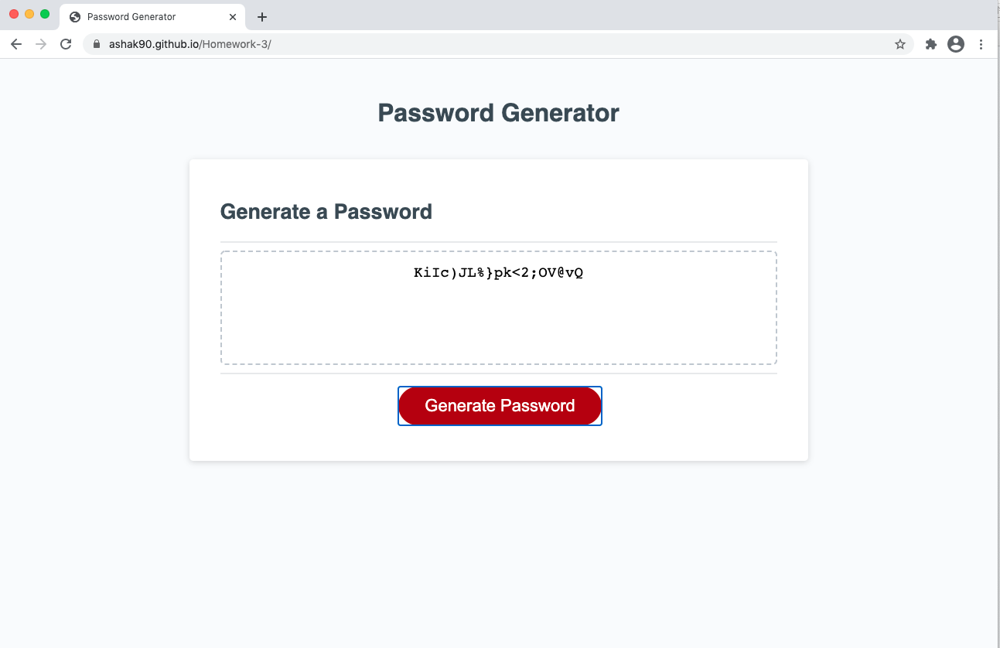

# 03 JavaScript: Password Generator

## Description

As required by the task and the acceptance criteria, I created a web application password generator. To accomplish this task I created a function that would create pop-up with a series of prompts when the "Generate Password" button is clicked. The prompts dictate the password length, and whether the password has upper case letters, lower case letters, numbers, and/or special characters. If the passord length that is chosen is between 8 and 128 and some or all of the character types are selected the password will be generated, based on what is selected -- this is the happy path. If the passord length is below 8, higher than 128 or not a number , or if non of the character types are choosen, then a password not be generated and the user will be taken back to application.

## Screenshots

**Final Product**

## URLs

**Deployed Link**

https://ashak90.github.io/Homework-3/
